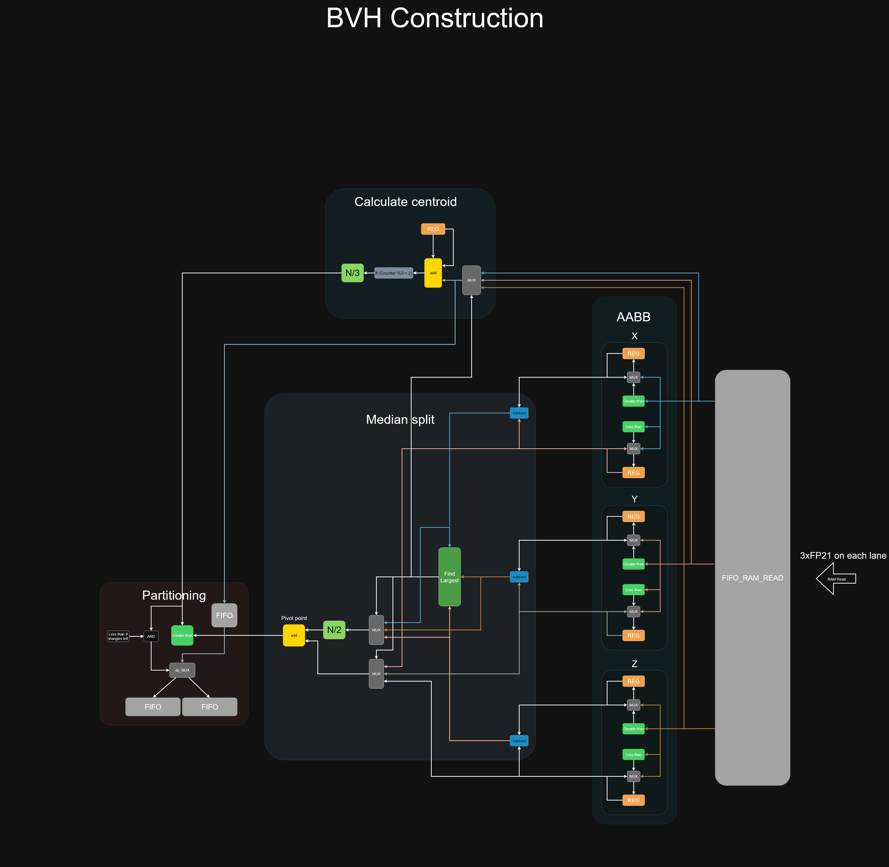

# Work in progress.

### Meanwhile here are the concepts:

Calculations will be done on reduced precision FP21 (8bit exponent and 12bit fraction). The precision loss needs to be compared to FP32, If significant artifacts arise the whole system needs to be converted to FP32.

Memory controller will be written from scratch (idealy). JEDEC standart and [UberDDR3](https://github.com/AngeloJacobo/UberDDR3) will be used as reference. (UberDDR3 is great but I would like to have my custom memory controller)

Machine will be separated into different functional groups (pipeline stages). BVH construction -> BVH traversal -> General purpose shader computation.

#### BVH construction:
BVH construction will use dual pointer partitioning method. Recursive partitioning will happen with "depth first" method. The BVH nodes will be stored in ram. (exact bit structructure has not been decided yet). For start, BVH-2 will be tested (2 child nodes per parent), but efficiency of BVH-4 and BVH-8 also needs to be looked into.

#### BVH traversal:
BVH traversal will use the slab method. This is the most important part of the accelerator. The Slab method calculation will be pipelined and multiple pipelines are going to be used (SIMD). The memory will store relative BVH node coordinates and will need to be converted to absolute object space (according to [this](https://arxiv.org/html/2505.24653v1) paper).

#### General purpose shader computation:
General purpose shader computation approach can be done multiple ways which include a classic CPU architecture or [Tagged Token Dataflow Architecture](https://csg.csail.mit.edu/pubs/memos/Memo-281/Memo-281.pdf). The exact approach is not known yet.

### BVH construction dataflow concept:
note: this concept is just a high level visualisation for me and will not look like the final product.

